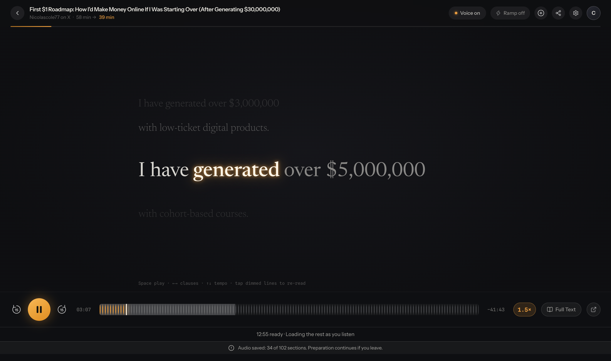

# Durable narration

The reader starts or joins one server preparation job for each article content digest and voice. It plays downloaded audio with the Soniox timings saved alongside that audio. Reopening an article downloads its saved sections rather than opening new Soniox streams in the browser.

Audio currently lives in **Convex file storage**, not Cloudflare R2. The job and section records live in Convex too. Moving object storage to R2 is independent of preventing repeated synthesis.

## Why the earlier fix was insufficient

The previous buffer change helped a short synthetic article but did not address the long-article path. Articles over 24,000 characters skipped server pre-generation. Browser sessions only saved a recording after the entire generation completed, and temporary-key expiry or stream fallback could restart that work. The live reproduction also returned `Soniox returned limit_exceeded` when requests competed for provider capacity.

The new reader uses durable preparation by default. The older browser/REST implementation remains as an explicit test/compatibility option; normal production loading no longer falls back into it.

## Current behavior

- Each roughly 650-character section runs as a bounded server action and saves both its MP3 and validated word timings. Short sections fit within Soniox's two-minute request limit and Convex's action limit.
- Two shared worker slots cap concurrency across articles. Soniox limits apply to the account and project, so limiting each article independently is insufficient. Capacity errors retry after a delay. Articles with fewer saved sections get the next free slot, so a long article does not block preparation of another article’s opening.
- Job creation, scheduling, completion and claiming the next section happen transactionally. Attempt tokens keep delayed watchdogs from interrupting a later retry. Failed sections can retry; completed sections retain their files.
- The browser downloads only contiguous completed sections. Timing offsets include each MP3's frame duration, including silence, rather than scaling timestamps to an estimated article duration.
- Play unlocks after one minute of audio at the selected speed is buffered. Short finished recordings unlock immediately. The existing 15-second refill behavior remains.
- The reader exposes saved-section progress and a Retry audio button for failures. A failed download or preparation does not silently start another whole-article synthesis.
- The durable path accepts up to 150,000 characters and 30,000 words. Section storage avoids the single-array timing limit. The reported article's full 11,561 words fit.

[Soniox documents shared concurrency limits](https://soniox.com/docs/guides/concurrency-limits) and [429 retry behavior](https://soniox.com/docs/api-reference/tts/websocket-api).

## Verification on September 5, 2026

The exact Nicolascole77 article from the user's library was used, with 66,129 characters and 11,561 words, divided into 102 sections.

- A regression test first failed because opening a long article requested no durable preparation job. It passes with the new default path.
- Server tests cover duplicate opens, shared capacity across articles, ordered delivery, saved-section reuse, stale callbacks and manual retry tokens.
- Player tests cover MP3-duration offsets and retaining completed audio after a later section fails.
- On the production-backed local reader at 1.5x, the article played past two minutes of audio with zero observed buffering or backward jumps, and authoritative timings throughout. The buffer grew during playback.
- A production replay unlocked after approximately 6.0 seconds with previously saved sections. No browser Soniox WebSocket opened. All 11,561 words were present. The subsequent three-minute playback sample covered 268 media seconds, with zero buffering samples or backward jumps and authoritative timings throughout.
- The long recording filled the browser MediaSource buffer. The existing MP3-parts fallback retained the audio and position; the production sample continued without an observed reset or refill. This still warrants physical mobile testing.
- A production storage read confirmed the first two sections still had their original storage IDs and attempt count of one after reloads. Preparation continued in the background. At that check, 22 sections were saved, two were running, 78 were queued and none had failed.

All 297 tests passed, workspace type checks passed, and the web production build passed. Existing marketing deprecation hints and the bundle-size advisory remain.

```sh
bun run test
bun run typecheck
bun run --cwd apps/web build
```

The backend is `notable-camel-807`. The reader deployment is Cloudflare Worker version `b58ae949-c8ce-48f0-9bb4-221f9ae42c66`, serving `assets/index-Dl2k9JRq.js`.

The original article fixture and bounded production-state snapshots are kept locally in this folder and excluded from Git. Live checks cover Dia. Physical iPhone playback and continuous playback of the entire hour-long article have not been verified.

Production verification data is in `durable-production-verification.json`.


