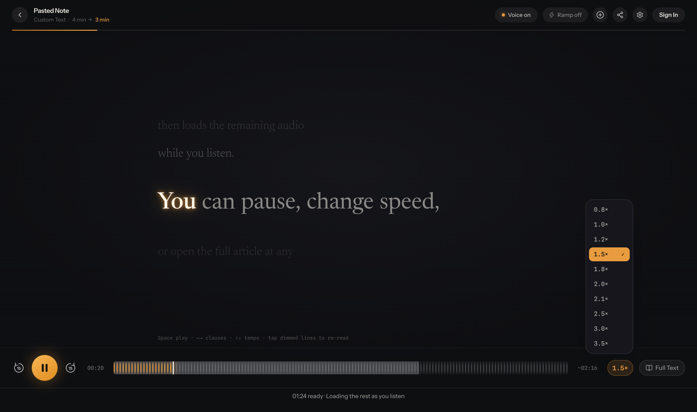

# Playback loading fix

The reader now prepares a minute of listening at the selected speed before enabling Play. Short completed recordings unlock immediately. Background generation continues during playback, with a visible downloaded section on the timeline and a counter showing how much audio is ready. Full Text remains available while audio is prepared.

## Causes and changes

- The saved-track and job-status lookups called kitcn's hook-based `queryOptions()` from async article-loading callbacks. This throws an invalid-hook-call error and skips the saved audio cache. Both calls now use the imperative `useCRPCClient()` client. Regression tests exercise the real lookup paths, with only the backend response mocked.
- The initial audio cushion was two seconds. Startup now waits for 60 seconds of listening at the selected speed. An underrun refills 15 seconds before resuming automatically. The target is capped at the remaining article duration and removed once generation finishes.
- Long generation segments blocked the delivery of already-generated later segments. The transport now targets roughly 400 characters per segment, split at sentence boundaries, with at most four concurrent sessions.
- WebSocket connections, stalled audio delivery, and trailing timing completion had no deadlines. They now have 15-second, 20-second, and 10-second deadlines respectively. Media-source opening and URL-based audio loading also have recovery deadlines.
- The long-text REST fallback waited for the entire response body. It now reads and plays the response progressively, with cancellation and a timeout for each read.
- Waiting for a background generation job is capped at five seconds instead of two minutes.
- A saved position beyond the downloaded audio is now retained until that audio arrives, including browsers that play separate MP3 parts.

The imperative query API is documented in [kitcn's React reference](https://github.com/udecode/kitcn/blob/main/packages/kitcn/skills/kitcn/references/features/react.md).

## Verification

On September 5, 2026, the updated local app was tested in Dia against the existing production backend, with a 3,720-character synthetic article at 1.5× speed.

- Play became available after 37.333 seconds while generation continued.
- The startup target was 90 media seconds, equivalent to one minute of listening at 1.5×.
- The complete audio was 243.192 seconds long.
- Playback reached the end with zero observed buffering transitions. Play was clicked after readiness, so this run does not measure starting at the earliest possible instant.
- Audio generation completed after 168.353 seconds. These changes improve startup and buffering; they do not guarantee faster whole-file generation.
- An earlier live run with roughly 1,200-character segments was still blocked at 49.887 seconds and had completed by 76.808 seconds. These are observations from two runs, not a controlled throughput benchmark.
- The development backend lacked `routers/tts:temporaryKey`. The live audio check used the production backend through a local app running in production mode instead.

All 289 tests passed, along with workspace type checks and the production build. Tests cover startup readiness, automatic refill, stalled connections, cancelled deadlines, progressive REST fallback, deferred resume positions, and real cache/job lookup calls.

Commands run from the project root:

```sh
bun run test
bun run typecheck
bun run build
```

The original failing checks can also be run from `apps/web`:

```sh
bun test src/utils/speechEngine.test.ts src/utils/sonioxStream.test.ts --test-name-pattern 'minute of listening|unresponsive connection'
bun test src/App.test.tsx --test-name-pattern 'real cache lookup|real job-status'
```

## Status

Deployed to production on September 5, 2026. The Convex deployment is `notable-camel-807`; the Cloudflare Worker version is `ecc102f3-eaf0-4b0e-9dae-caa38a73b373`. The live reader serves `assets/index-1TuRHH6o.js`. The browser run covered Dia. The MP3-parts fallback has automated coverage but was not tested on a physical iPhone. Longer articles and other network conditions may still need refills if synthesis cannot keep up with playback.


